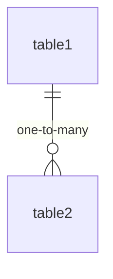

# {Feature Name} Specification

## Background / Context

Background and necessity of the feature (2-3 lines).

## Goals

- Primary objectives (bullet list)
- User value
- Business impact

## Overview

Brief overview of the entire feature (2-3 lines).

## Detailed Specification

### Core Features

#### 1. Feature Component 1
- Detailed description
- Behavior specification
- Constraints

#### 2. Feature Component 2
- Detailed description
- Behavior specification
- Constraints

## Data Structure (omit if N/A)

### Entity Relationships



### Schema Definitions

| Column | Type | Constraints | Description |
|--------|------|-------------|-------------|
| id | integer | PK | Primary key |
| name | string | NOT NULL | Name |
| created_at | timestamp | NOT NULL | Creation timestamp |
| updated_at | timestamp | NOT NULL | Last update timestamp |

## API Specification (omit if N/A)

### 1. Endpoint Name

- **Endpoint**: `GET /resources`
- **Description**: Resource description
- **Parameters**:
  - `page`: Page number
  - `per`: Items per page
- **Response**:

```json
{
  "resources": [],
  "meta": {}
}
```

## UI / Screen Design (omit if N/A)

### 1. Screen Name

- **Path**: `/path/to/screen`
- **Overview**: Screen description
- **Key Features**:
  - Feature 1
  - Feature 2
- **UI Elements**:
  - Element 1
  - Element 2

## Implementation Plan

### Phase 1
- Core implementation items
- Constraints

### Future Extensions
- Potential future enhancements

## File Structure

```text
(Expected file changes and additions based on project structure)
```

## Next Steps

- `/implement` to start implementation
- `/code-review` for review
